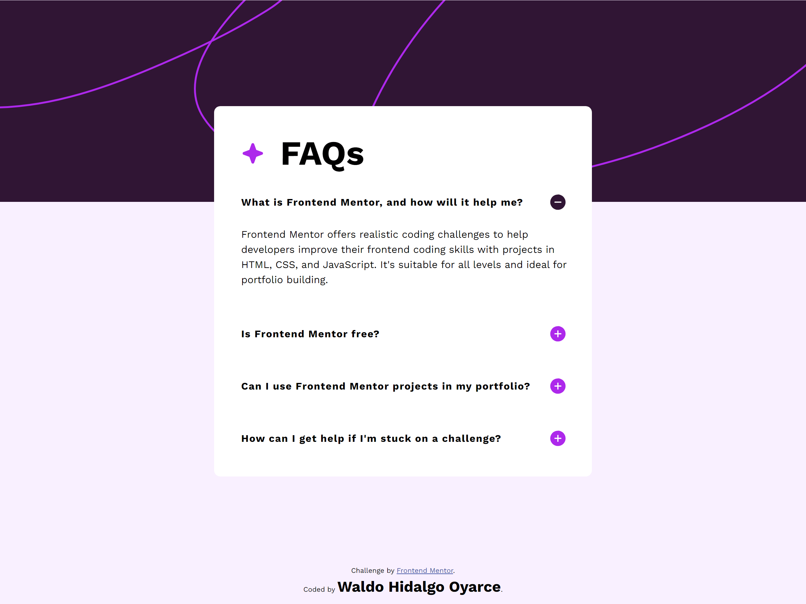
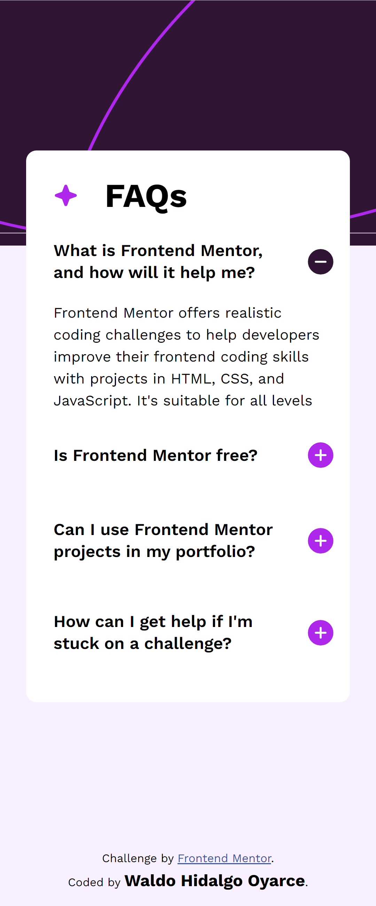

# Frontend Mentor - FAQ accordion solution

Esta es mi solución al desafío [FAQ accordion challenge on Frontend Mentor](https://www.frontendmentor.io/challenges/faq-accordion-wyfFdeBwBz). He utilizado las siguientes tecnologías:

## Overview

### The challenge

Users should be able to:

- Hide/Show the answer to a question when the question is clicked. **Realizado**

- Navigate the questions and hide/show answers using keyboard navigation alone: **Realizado**: he utilizado el evento onkeydown con las teclas **ArrowDown**,**ArrowUp** para navegar entre las filas del accordion y **Enter** para mostrar/ocultar el contenido de la fila del accordion.

- View the optimal layout for the interface depending on their device's screen size: Proyecto responsivo en base a las medidas de las imagenes de diseño móvil y de escritorio.

- See hover and focus states for all interactive elements on the page:**Realizado**: Cambia color al hacer hover sobre el encabezado de cada fila del accordion o al desplazarse sobre cada fila usando el teclado el cual desaparece al hacer click sobre la fila o al presionar Enter sobre la fila.

### Screenshots

#### 1. Pantallas Grandes

#### 2. Pantallas Small

### Links

- Live Site URL: [Add live site URL here](https://your-live-site-url.com)
